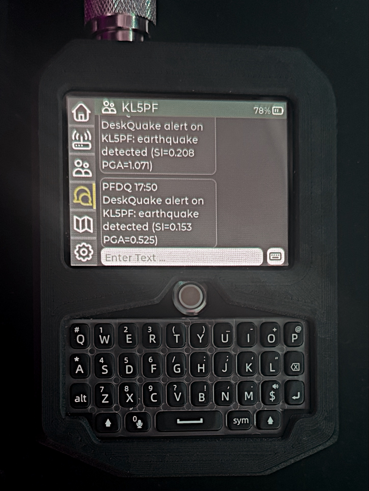

<h1 align="center">DeskQuake for RAK4631</h1>

  

  
  
  
  

  Earthquake-monitoring firmware for RAK4631 with local mesh alerting, operator serial commands, and drag-and-drop UF2 releases.

  ⚠️ <strong>Experimental seismic mesh node</strong> 
  Built in Alaska. Tested in real-world conditions.

## What It Does

  

DeskQuake turns a RAK4631 + RAK12027 into a distributed seismic detection node.

It monitors ground motion locally and broadcasts alerts across a Meshtastic network — enabling real-time awareness in remote or off-grid environments.

## System Flow
RAK12027 Sensor (D7S)**  
↓  
**Seismic Data (SI / PGA) 
↓  
**DeskQuake Detection Logic**  
↓  
**Trigger Event**  
↓  
**Meshtastic Broadcast**  
↓  
**Mesh Network (Multi-hop)**  
↓  
**Remote Nodes Receive Alert**

> Built for off-grid environments — where the mesh *is* the infrastructure.

## Download

Current prerelease:
[DeskQuake Beta 0.1 for RAK4631](https://github.com/kl5pfak/deskquake-firmware/releases/tag/deskquake-v0.1-beta1)

Direct firmware download:
[DeskQuake-Beta-0.1-rak4631.uf2](https://github.com/kl5pfak/deskquake-firmware/releases/download/deskquake-v0.1-beta1/DeskQuake-Beta-0.1-rak4631.uf2)

Repository:
[kl5pfak/deskquake-firmware](https://github.com/kl5pfak/deskquake-firmware)

---

## Quick Start

1. Put the RAK4631 into UF2 bootloader mode.
2. Drag the UF2 file onto the mounted bootloader volume.
3. Reconnect to serial at `115200`.
4. Run `dqcount`, `dqreset`, or `dqdfu` to verify the beta tooling.

---

## Sensor Hardware

- Target board: RAK4631
- Sensor module: RAK12027 using the Omron D7S sensor
- Sensor bus: I2C address `0x55`
- Sensor power control: `WB_IO2`
- Current alert channel label in firmware: `KL5PF`

Sensor reference:
- [RAKwireless RAK12027 Earthquake Sensor Omron D7S PID 100106](https://store.rokland.com/products/rakwireless-rak12027-earthquake-sensor-omron-d7s-pid-100106?_pos=1&_psq=Earth&_ss=e&_v=1.0&ref=FairbanksMesh)
- [RAK12027 Datasheet](https://docs.rakwireless.com/Product-Categories/WisBlock/RAK12027/Datasheet/)

---

## Operator Commands

- `dqcount`
- `dqreset`
- `dqdfu`
- `dqhelp`

Helper script:
- `bin/deskquake-command.sh`

Reliable macOS UF2 upload helper:
- `bin/upload-rak4631-uf2.sh`

---

## Attribution

DeskQuake Firmware is maintained in this repository by KL5PFAK and is derived from the Meshtastic firmware project.

Upstream project:
[meshtastic/firmware](https://github.com/meshtastic/firmware)

Credit and thanks go to the Meshtastic maintainers and contributors whose work this repository builds on.

This repository continues to distribute the code under the GPLv3 terms in [LICENSE](https://github.com/kl5pfak/deskquake-firmware/blob/deskquake-beta-0.1/LICENSE).
